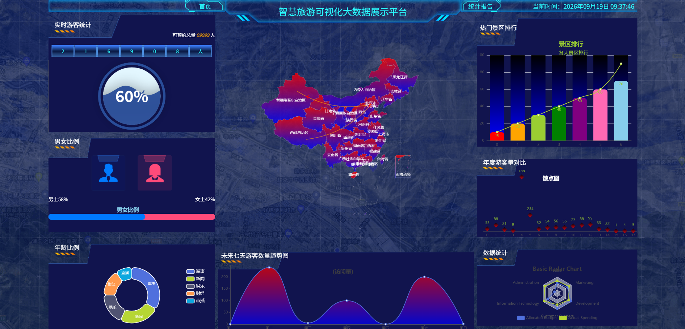
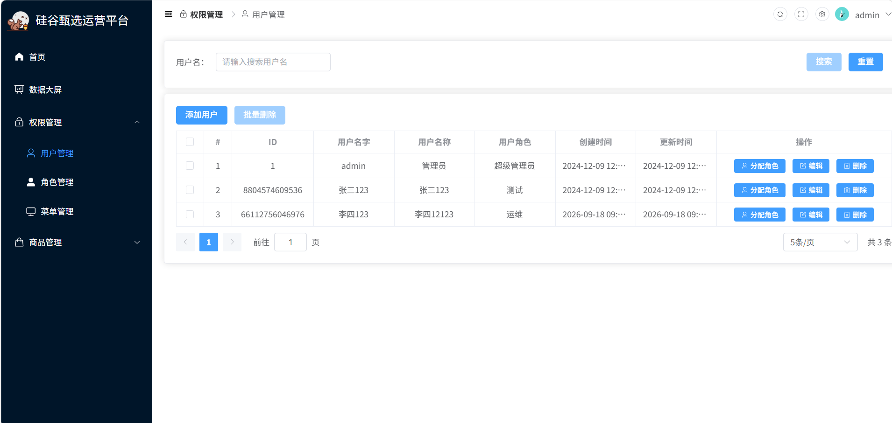
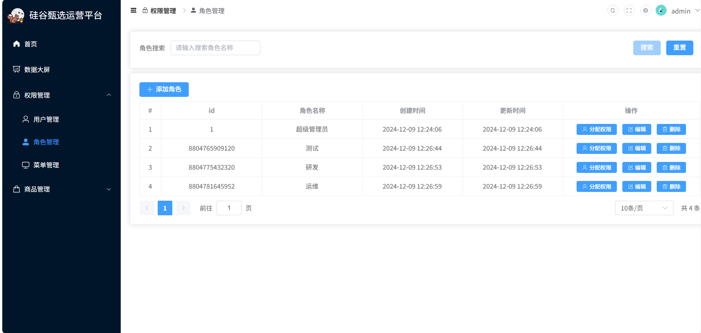
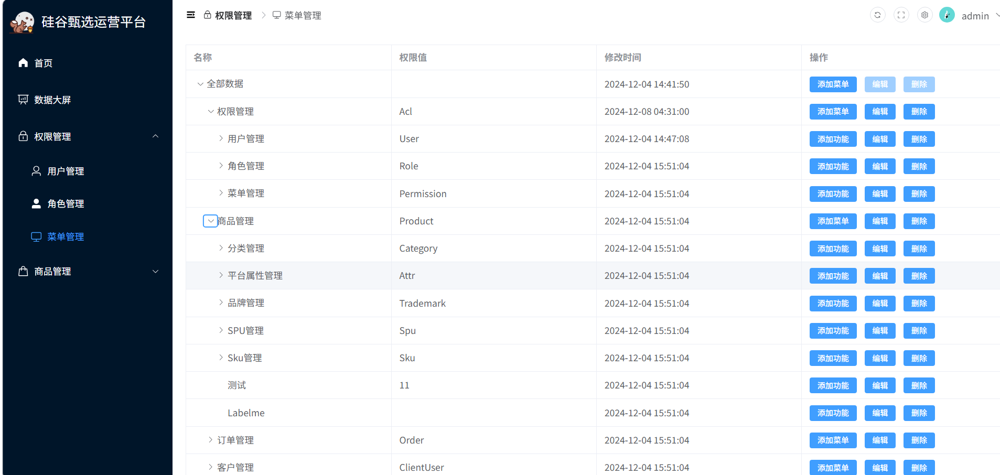
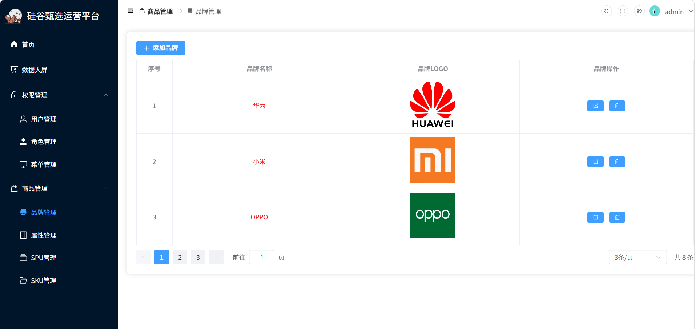
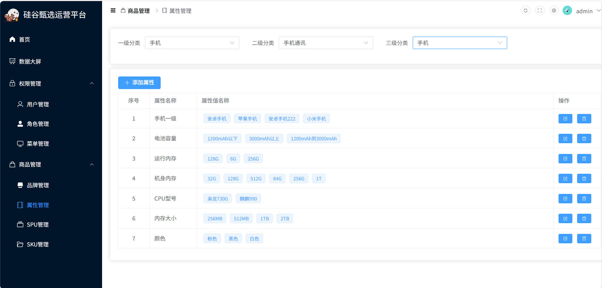
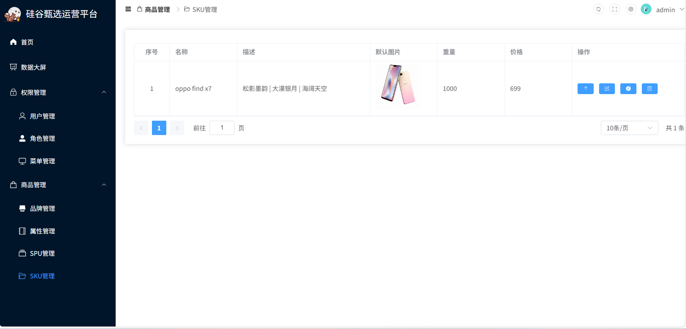
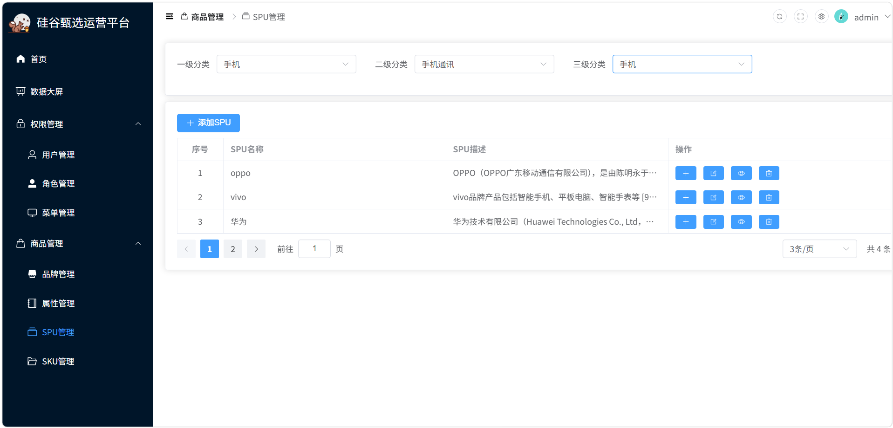
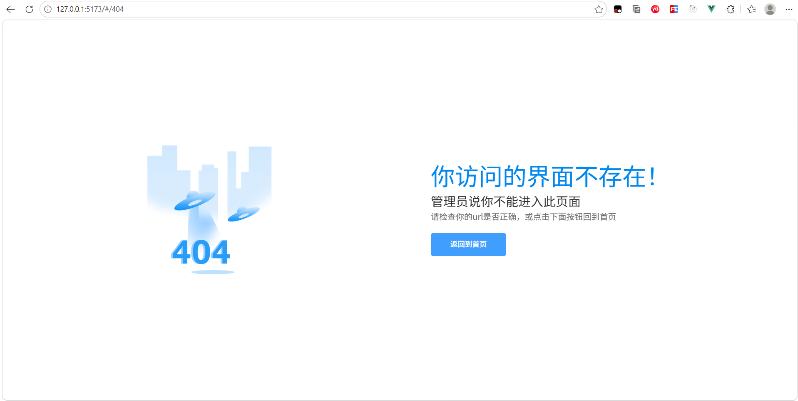

# 通用后台管理系统（硅谷甄选后台管理系统）（前端）

## 📚 项目简介

基于 Vue3 + TypeScript + Element‑Plus 开发的B端电商运营后台，实现登录鉴权、品牌管理、角色权限分配，完整实现RBAC权限模型，支持动态路由。

> 本项目为尚硅谷实战项目，后端项目保存在本地，使用WSL2 + Docker Compose启动后端与MySQL数据库。

## ✨ 项目特性

🚀 **前沿技术栈**：Vue3 + TypeScript + Vite + Pinia
🎨 **UI组件库**：Element‑Plus，后台通用布局
🔐 **RBAC权限控制**：菜单动态路由 + 按钮级自定义权限指令
🏗️ **模块化架构**：api、组件、路由、状态管理分层清晰
🔧 **工程化规范**：ESLint + Prettier，axios请求统一封装拦截

## 📦 主要依赖

# 硅谷甄选后台管理系统（前端）

## 📚 项目简介

基于 Vue3 + TypeScript + Element‑Plus 开发的B端电商运营后台，实现登录鉴权、商品品牌管理、角色权限分配，完整实现RBAC权限模型，支持动态路由。

> 本项目为尚硅谷B站教学实战项目，后端采用开源SpringBoot服务，使用WSL2 + Docker Compose一键启动后端与MySQL数据库。
> 与原版视频区别：按钮权限指令功能已实现，页面未全部铺满指令。

## ✨ 项目特性

🚀 **前沿技术栈**：Vue3 + TypeScript + Vite + Pinia
🎨 **UI组件库**：Element‑Plus，后台通用布局
🔐 **RBAC权限控制**：菜单动态路由 + 按钮级自定义指令权限
🏗️ **模块化架构**：api、组件、路由、状态管理分层清晰
🔧 **工程化规范**：ESLint + Prettier，请求统一封装拦截

## 📦 主要依赖

- Vue3：渐进式前端框架
- TypeScript：提供静态类型约束
- Vite：快速构建工具
- Vue‑Router4：路由管理、全局路由守卫、动态路由
- Pinia：全局状态管理
- Axios：请求封装，统一处理Token、错误拦截
- Element‑Plus：UI组件库

## 🚀 快速开始

### 环境要求

- Node.js >=16.0.0
- pnpm >=8.0.0

```bash
# 全局安装pnpm
npm i -g pnpm
```

### 安装依赖

```
pnpm install
```

### 启动开发环境

```
pnpm dev
```

浏览器访问 `http://localhost:5173`

### 打包构建

> 存在部分未使用变量警告，项目可正常打包

```
pnpm build
```

### 后端启动

> 后端仅本地保存，未上传 Git 仓库；请在 WSL2 终端进入后端项目目录执行

```
docker compose up -d
```

> 后端接口基准地址：`127.0.0.1:10086`

## 📁 项目目录结构

```
src
├── api                     # 接口请求模块
│   ├── acl                 # 权限相关接口
│   │   ├── menu            # 菜单接口
│   │   ├── role            # 角色接口
│   │   └── user            # 用户接口
│   ├── product             # 商品模块接口
│   │   ├── attr            # 属性接口
│   │   ├── sku             # SKU接口
│   │   ├── spu             # SPU接口
│   │   └── trademark       # 品牌接口
│   └── user                # 用户接口
├── assets                  # 静态资源
│   ├── icons               # svg图标
│   ├── images              # 图片资源
│   │   └── error_images    # 错误页图片
│   └── styles              # 全局scss样式
├── components              # 全局公共组件
│   ├── Category            # 分类组件
│   └── SvgIcon             # svg图标组件
├── directive               # 自定义指令
│   └── has.ts              # 按钮权限指令
├── layout                  # 后台页面布局组件
│   ├── logo                # logo组件
│   ├── main                # 主内容区域
│   ├── menu                # 侧边菜单
│   └── tabbar              # 标签栏
│       ├── breadcrumb      # 面包屑
│       └── setting         # 设置抽屉
├── router                  # 路由配置
├── store                   # Pinia状态管理
│   └── modules             # store模块拆分
│       └── types           # store类型定义
├── utils                   # 工具函数
│   ├── request.ts          # axios请求封装
│   ├── time.ts             # 时间处理
│   └── token.ts            # token存取
└── views                   # 页面组件
    ├── 404                 # 404页面
    ├── acl                 # 权限管理页面
    │   ├── permission      # 菜单权限
    │   ├── role            # 角色管理
    │   └── user            # 用户管理
    ├── home                # 首页
    ├── login               # 登录页
    ├── product             # 商品管理页面
    │   ├── attr            # 属性管理
    │   ├── sku             # SKU管理
    │   ├── spu             # SPU管理
    │   └── trademark       # 品牌管理
    └── screen              # 数据大屏页面
        ├── components      # 大屏子组件
        │   ├── age
        │   ├── counter
        │   ├── line
        │   ├── map
        │   ├── rank
        │   ├── sex
        │   ├── top
        │   ├── tourist
        │   └── year
        └── images          # 大屏图片


```

## 🎯 核心功能模块

### 1. 用户登录与权限控制


- JWT‑Token 登录认证，全局路由守卫拦截未登录访问
- 根据后端返回权限数据生成**动态侧边栏路由**
- 自定义指令实现页面按钮级权限控制

### 2. 数据大屏模块



- 基于 ECharts 组件完成可视化大屏开发，渲染各类统计图表
- 对接后端统计接口，展示业务数据，实现图表数据渲染与自适应

### 3. 权限管理模块

#### 3.1 用户管理



- 用户信息分页查询、新增、编辑、删除操作
- 支持为用户分配对应业务角色，关联权限体系

#### 3.2 角色管理



- 角色信息增删改查维护
- 通过树形组件完成角色菜单权限分配，与后端维护角色‑菜单关联关系

#### 3.3 菜单管理



- 系统菜单的层级化维护，支持菜单新增、编辑、删除
- 维护菜单资源，作为动态路由、权限分配的数据来源

### 4. 商品管理模块

#### 4.1 品牌管理



- 品牌分页列表、新增、编辑、删除；支持图片上传与表单校验

#### 4.2 属性管理



- 商品属性与属性值维护，完成规格参数的增删改查

#### 4.3 sku管理



- SKU 商品库存单元管理，实现 SKU 数据增删改查与页面展示

#### 4.4 spu管理



- SPU 标准化产品单元维护，完成商品基础信息增删改查

### 5. 路由异常处理（404 & 任意路由）



- 配置 Vue Router 任意路由匹配规则，捕获不存在页面访问
- 当访问不存在路由地址时，自动重定向到 404 友好提示页面，优化用户访问体验

## ⚠️ GitHub Pages 线上预览说明

> GitHub Pages 仅可查看登录页面，无法调用接口。
> **完整 CRUD 业务功能，需要本地同时启动后端服务（127.0.0.1:10086）。**

## 🔗 仓库链接

- 前端仓库：当前仓库

> 后端本地存储，运行在本机 WSL2 Docker 环境，接口基准地址 `127.0.0.1:10086`

## 📝 开发规范

1. ESLint + Prettier 统一代码格式
2. TypeScript 对接口数据做类型约束
3. 组件采用 PascalCase 命名，文件短横线命名，变量驼峰命名

> # 欢迎提交 Issue 交流。
